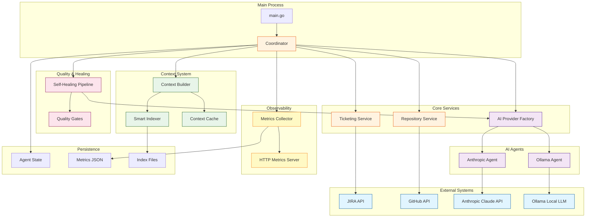
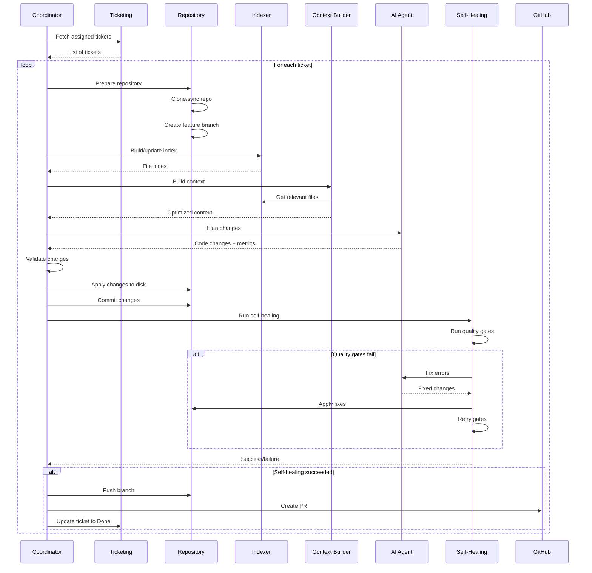

# System Architecture

High-level architecture of the AI Intern Agent system.

## Overview

The AI Intern Agent is an autonomous software engineering system that reads JIRA tickets, analyzes code repositories, generates changes using AI, and creates pull requests automatically.

## System Architecture Diagram



## Component Overview

### 1. Main Process (`cmd/agent/main.go`)
- **Purpose**: Entry point and CLI handling
- **Responsibilities**:
  - Parse command-line flags (--init, --build-index, --status, --metrics)
  - Load configuration from environment
  - Initialize all services
  - Start coordinator with context

**Key Functions**:
- `main()` - Entry point
- `buildIndex()` - CLI command for indexing
- `showStatus()` - CLI command for status
- `showMetrics()` - CLI command for metrics

### 2. Coordinator (`internal/orchestrator/coordinator.go`)
- **Purpose**: Main orchestration loop
- **Responsibilities**:
  - Poll JIRA for tickets
  - Manage worker pool
  - Orchestrate ticket processing pipeline
  - Handle errors and retries
  - Track metrics

**Key Methods**:
- `Run(ctx)` - Main polling loop
- `processTicket(ctx, ticket)` - Process single ticket
- `prepareRepository(ctx)` - Clone/sync repo

**Location**: `internal/orchestrator/coordinator.go:28-350`

### 3. Ticketing Service (`internal/ticketing/`)
- **Purpose**: JIRA integration facade
- **Implementations**:
  - `jira-raw/` - HTTP-based JIRA client
  - Future: `jira-go/` - Official go-jira library

**Interface**:
```go
type TicketingClient interface {
    FetchAssignedTickets(username string) ([]Ticket, error)
    UpdateTicketStatus(key, transitionID string) error
}
```

### 4. Repository Service (`internal/repository/`)
- **Purpose**: Git and GitHub operations
- **Responsibilities**:
  - Clone repositories
  - Create branches
  - Commit changes
  - Push to remote
  - Create pull requests

**Interface**:
```go
type RepositoryClient interface {
    Clone(ctx, url, path string) error
    CreateBranch(ctx, name string) error
    Commit(ctx, message string) error
    Push(ctx, branch string) error
    CreatePR(ctx, title, body, base, head string) (*PullRequest, error)
}
```

### 5. AI Provider System (`internal/ai/`, `internal/provider/`)

#### Agent Interface (`internal/ai/agent/agent.go`)
```go
type Agent interface {
    PlanChanges(ctx, ticketKey, summary, description, repoContext string)
        ([]CodeChange, *UsageMetrics, error)

    FixErrors(ctx, ticketKey, summary, errorType, errorOutput string,
        previousChanges []CodeChange)
        ([]CodeChange, *UsageMetrics, error)
}
```

#### Factory Pattern (`internal/provider/factory.go`)
- Instantiates correct provider based on config
- Supports Anthropic and Ollama
- Easily extensible for new providers

#### Implementations
- **Anthropic** (`ai/agent/anthropic/`) - Claude Sonnet 4 via API
- **Ollama** (`ai/agent/ollama/`) - Local LLMs (qwen2.5-coder, deepseek-coder)

### 6. Context System

#### Smart Indexer (`internal/indexer/indexer.go`)
- **Purpose**: Build searchable file index
- **Features**:
  - Full repository scan
  - Incremental updates (git-based)
  - File categorization
  - Importance scoring
  - Dependency extraction

**Location**: `internal/indexer/indexer.go:44-350`

#### Context Builder (`internal/ai/context_builder.go`)
- **Purpose**: Build AI-ready context
- **Strategies**:
  - **Smart Context**: Keyword-based file selection with scoring
  - **Simple Context**: All files up to limit
- **Optimization**: Minimal context extraction for large files

#### Context Cache (`internal/ai/context_cache.go`)
- **Purpose**: Cache context to save tokens
- **Invalidation**: Git commit hash + TTL
- **Savings**: 40-50% token reduction

### 7. Self-Healing System (`internal/orchestrator/self_heal.go`)

**Purpose**: Automatically fix code quality issues

**Components**:
- `selfHealingPipeline()` - Main retry loop
- `tryHealErrors()` - AI-driven error fixing
- `runGoVet/Test/Build()` - Quality gate runners
- `applyCodeChange()` - Apply fixes to disk

**Flow**: Run gates → Detect errors → Call AI → Apply fixes → Retry

**Location**: `internal/orchestrator/self_heal.go:102-253`

### 8. Metrics & Observability

#### Metrics Collector (`internal/orchestrator/metrics.go`)
- **Thread-safe**: Uses atomic operations
- **Tracks**:
  - Tickets processed, PRs created, failures
  - Token usage and costs
  - Context strategy (smart vs simple)
  - Self-healing attempts and success rate
  - Execution time and files changed

#### Metrics Server (`internal/orchestrator/metrics_server.go`)
- **Endpoints**:
  - `/metrics` - Prometheus format
  - `/` - HTML dashboard with auto-refresh
  - `/health` - Health check JSON
- **Port**: Configurable (default: 9090)

### 9. Persistence

#### Agent State (`internal/orchestrator/state.go`)
- Tracks processed tickets (prevent reprocessing)
- JSON file: `agent_state.jsonc`
- Thread-safe with mutex

#### Metrics Files (`.ai-intern/metrics.json`)
- Per-run metrics with timestamp
- Ticket-level details
- Loaded by `--metrics` CLI command

#### Index Files (`.ai-intern/file_index.json`)
- File metadata with git commit hash
- Supports incremental updates
- Used by smart context builder

## Data Flow

### Ticket Processing Pipeline



## Configuration

### Environment Variables
All configuration via environment variables (`.env` file supported):

**Categories**:
- JIRA integration (URL, credentials, transitions)
- GitHub integration (token, owner, repo)
- AI provider (Anthropic API key or Ollama config)
- Agent behavior (polling, concurrency, working dir)
- Context limits (max files, max bytes, cache TTL)
- Self-healing (enabled, max attempts, gate selection)
- Metrics (enabled, port)
- Operational (dry run mode)

**File**: `internal/config/config.go:62-180`

### Configuration Loading
1. Load `.env` file if present (via godotenv)
2. Read environment variables (via viper)
3. Apply defaults for optional fields
4. Validate required fields
5. Return Config struct

## Error Handling

### Transient vs Permanent Errors
- **Transient**: Retried with exponential backoff
  - Network errors
  - Rate limits
  - Temporary API failures
- **Permanent**: Fail fast, no retry
  - Auth errors
  - Invalid configuration
  - Validation failures

### Retry Logic (`internal/orchestrator/backoff.go`)
```go
type BackoffConfig struct {
    InitialDelay  time.Duration
    MaxDelay      time.Duration
    Multiplier    float64
    MaxRetries    int
}
```

**Strategy**: Exponential backoff with jitter

## Performance Characteristics

### Token Usage
- **Simple Context**: ~100-500KB → 25K-125K tokens
- **Smart Context**: ~50-200KB → 12K-50K tokens
- **Savings**: 40-60% with smart context + caching

### Processing Time
- **Index build**: 2-5 seconds (full), 50-200ms (incremental)
- **Context build**: 100-500ms (smart), 50-100ms (cached)
- **AI planning**: 10-30 seconds (depends on context size)
- **Self-healing**: +5-15 seconds per attempt

### Cost Optimization
- Use Ollama for free local processing
- Enable context caching (40-50% savings)
- Use smart context (30-40% savings)
- Combined: Up to 70% cost reduction

## Scalability

### Concurrency
- **Worker Pool**: `MAX_CONCURRENT_TICKETS` (default: 1)
- **Semaphore**: Controls concurrent ticket processing
- **Thread Safety**: Atomic operations for shared state

### Limitations
- **JIRA API**: Rate limited (check JIRA docs)
- **GitHub API**: 5000 requests/hour
- **Anthropic API**: Rate limits vary by tier
- **Ollama**: Limited by local GPU/CPU

## Security

### Credentials
- Stored in environment variables
- Never committed to git
- `.env` file in `.gitignore`

### Code Validation
- Path traversal prevention
- Directory allowlist
- File count limits
- No execution of generated code (only static analysis)

### API Access
- All external APIs use TLS
- GitHub personal access tokens (not passwords)
- JIRA API tokens (not passwords)

## Monitoring

### Metrics Available
- Tickets processed/failed
- PRs created
- Cost and token usage
- Self-healing success rate
- Context strategy usage
- Execution time
- Files changed

### Dashboards
- **HTTP Dashboard**: http://localhost:9090/
- **Prometheus**: http://localhost:9090/metrics
- **CLI**: `./agent --metrics`

## Future Architecture Improvements

See [NEXT_FEATURES_ROADMAP.md](NEXT_FEATURES_ROADMAP.md) for:
- Webhook-based triggering
- Multi-repository support
- Parallel file processing
- Database storage
- Distributed execution
- Advanced caching strategies
