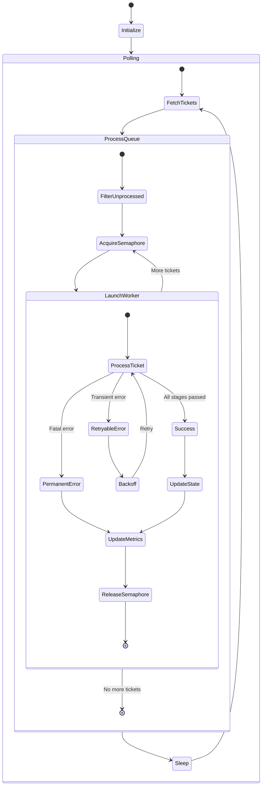
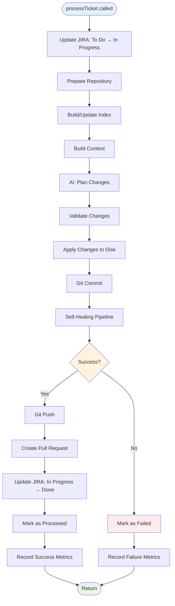
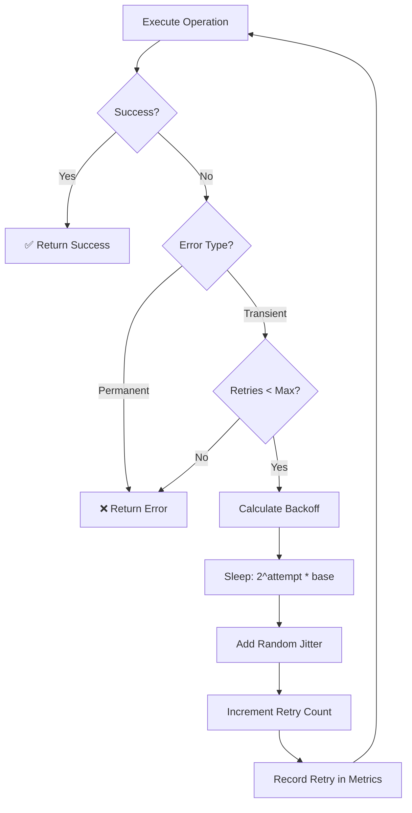
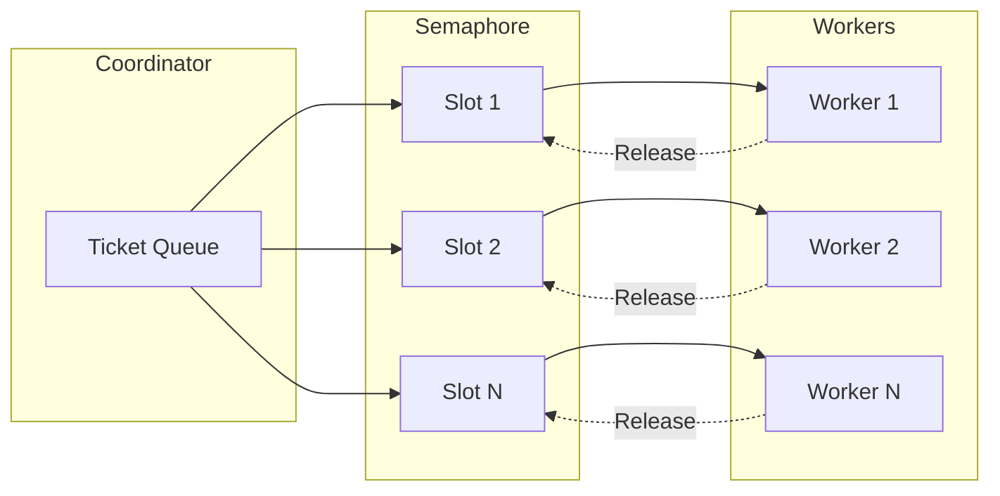

# Coordinator Deep Dive

Detailed documentation of the Coordinator - the main orchestration component.

## Overview

The Coordinator (`internal/orchestrator/coordinator.go`) is the heart of the AI Intern Agent. It manages the main polling loop, worker pool, ticket processing pipeline, and error handling.

## Coordinator Structure

```go
type Coordinator struct {
    Ticketing  *ticketing.TicketingService
    Repository *repository.RepositoryService
    Agent      agent.Agent
    Cfg        *config.Config
    State      *State
    Metrics    *Metrics
}
```

**Location**: `internal/orchestrator/coordinator.go:20-27`

## State Machine



## Main Loop

### Run() Method

**File**: `internal/orchestrator/coordinator.go:33-92`

```go
func (c *Coordinator) Run(ctx context.Context) {
    // 1. Parse polling interval
    interval, _ := time.ParseDuration(c.Cfg.PollingInterval)

    // 2. Setup workspace
    workingDir := c.Cfg.WorkingDir
    os.MkdirAll(workingDir, 0755)

    // 3. Start metrics server (if enabled)
    if c.Cfg.MetricsEnabled {
        go metricsServer.Start(ctx)
    }

    // 4. Defer cleanup
    defer func() {
        c.saveMetrics()
        c.printSummary()
    }()

    // 5. Main polling loop
    ticker := time.NewTicker(interval)
    for {
        select {
        case <-ctx.Done():
            return // Shutdown signal
        case <-ticker.C:
            c.pollAndProcess(ctx)
        }
    }
}
```

### Poll and Process

```go
func (c *Coordinator) pollAndProcess(ctx context.Context) {
    // 1. Fetch tickets from JIRA
    tickets, err := c.Ticketing.FetchAssignedTickets(c.Cfg.AgentUsername)
    if err != nil {
        logger.Error("Failed to fetch tickets", "error", err)
        return
    }

    // 2. Filter already processed
    unprocessed := []ticketing.Ticket{}
    for _, ticket := range tickets {
        if !c.State.IsProcessed(ticket.Key) {
            unprocessed = append(unprocessed, ticket)
        }
    }

    // 3. Process with semaphore (concurrency control)
    sem := make(chan struct{}, c.Cfg.MaxConcurrentTickets)
    var wg sync.WaitGroup

    for _, ticket := range unprocessed {
        wg.Add(1)
        sem <- struct{}{} // Acquire

        go func(t ticketing.Ticket) {
            defer wg.Done()
            defer func() { <-sem }() // Release

            c.processTicket(ctx, t)
        }(ticket)
    }

    wg.Wait()
}
```

## Ticket Processing Pipeline

### Pipeline Stages



### processTicket() Method

**File**: `internal/orchestrator/coordinator.go:150-400`

```go
func (c *Coordinator) processTicket(ctx context.Context, ticket ticketing.Ticket) error {
    // Create ticket context for logging
    ctx = logger.WithTicketContext(ctx, ticket.Key)
    startTime := time.Now()

    logger.Info("Processing ticket",
        "key", ticket.Key,
        "summary", ticket.Summary)

    // Track this ticket in metrics
    ticketMetrics := NewTicketMetrics(ticket.Key, nil)
    defer func() {
        ticketMetrics.SetExecutionTime(time.Since(startTime))
        c.Metrics.AddExecutionTime(time.Since(startTime))
    }()

    // 1. Update JIRA status
    if err := c.Ticketing.UpdateTicketStatus(ticket.Key, "In Progress"); err != nil {
        return fmt.Errorf("update status: %w", err)
    }

    // 2. Prepare repository
    repoPath, err := c.prepareRepository(ctx)
    if err != nil {
        return fmt.Errorf("prepare repo: %w", err)
    }

    // 3. Build/update index
    index, err := c.buildOrUpdateIndex(ctx, repoPath)
    if err != nil {
        logger.Warn("Index build failed, continuing", "error", err)
    }

    // 4. Build context
    context, strategy, err := c.buildContext(ctx, ticket, repoPath, index)
    if err != nil {
        return fmt.Errorf("build context: %w", err)
    }

    // Track context strategy
    if strategy == "smart" {
        c.Metrics.IncSmartContextUsed()
    } else {
        c.Metrics.IncSimpleContextUsed()
    }

    // 5. AI planning
    changes, usageMetrics, err := c.Agent.PlanChanges(
        ctx,
        ticket.Key,
        ticket.Summary,
        ticket.Description,
        context,
    )
    if err != nil {
        c.Metrics.IncAIPlanFailures()
        return fmt.Errorf("plan changes: %w", err)
    }

    // Record usage
    c.Metrics.AddTokenUsage(
        usageMetrics.InputTokens,
        usageMetrics.OutputTokens,
        usageMetrics.EstimatedCost,
    )

    // 6. Validate changes
    valid, err := ValidatePlannedChanges(changes, c.Cfg)
    if err != nil {
        return fmt.Errorf("validate: %w", err)
    }

    // 7. Apply changes
    for _, change := range valid {
        if err := c.applyChange(repoPath, change); err != nil {
            return fmt.Errorf("apply change: %w", err)
        }
    }

    // 8. Commit
    commitMsg := fmt.Sprintf("feat(%s): %s", ticket.Key, ticket.Summary)
    if err := c.Repository.Commit(ctx, commitMsg); err != nil {
        return fmt.Errorf("commit: %w", err)
    }

    // 9. Self-healing pipeline
    healResult, err := c.selfHealingPipeline(ctx, ticket.Key, ticket.Summary, valid, repoPath)
    if err != nil {
        return fmt.Errorf("self-healing: %w", err)
    }

    // Track healing metrics
    if len(healResult.Attempts) > 0 {
        c.Metrics.AddHealAttempts(len(healResult.Attempts))
        if healResult.Success {
            c.Metrics.IncHealSuccesses()
        } else {
            c.Metrics.IncHealFailures()
        }
    }

    // If healing failed, mark ticket as failed
    if !healResult.Success {
        c.Metrics.IncTicketsFailed()
        ticketMetrics.MarkFailed(fmt.Errorf("self-healing failed"))
        return fmt.Errorf("quality gates failed after healing")
    }

    // 10. Push branch
    branchName := c.getBranchName(ticket.Key)
    if err := c.Repository.Push(ctx, branchName); err != nil {
        return fmt.Errorf("push: %w", err)
    }

    // 11. Create PR
    pr, err := c.createPullRequest(ctx, ticket, valid, healResult)
    if err != nil {
        return fmt.Errorf("create PR: %w", err)
    }

    logger.Info("PR created", "url", pr.URL)

    // 12. Update JIRA to Done
    if err := c.Ticketing.UpdateTicketStatus(ticket.Key, "Done"); err != nil {
        return fmt.Errorf("update status: %w", err)
    }

    // 13. Mark as processed
    c.State.MarkProcessed(ticket.Key)

    // 14. Record success metrics
    c.Metrics.IncTicketsProcessed()
    c.Metrics.IncPRsCreated()
    c.Metrics.AddFilesChanged(len(valid))
    ticketMetrics.SetFilesChanged(len(valid))

    logger.Info("Ticket completed successfully",
        "key", ticket.Key,
        "pr", pr.URL,
        "cost", usageMetrics.EstimatedCost,
        "duration", time.Since(startTime))

    return nil
}
```

## Error Handling & Retry Logic

### Retry Strategy



### Retry Implementation

**File**: `internal/orchestrator/backoff.go:30-90`

```go
func Retry(ctx context.Context, cfg BackoffConfig, fn func() error) error {
    var lastErr error
    delay := cfg.InitialDelay

    for attempt := 0; attempt <= cfg.MaxRetries; attempt++ {
        // Try the operation
        err := fn()

        if err == nil {
            return nil // Success!
        }

        // Check if error is transient
        if !IsTransient(err) {
            return err // Permanent error, fail fast
        }

        lastErr = err

        // Check if we should retry
        if attempt >= cfg.MaxRetries {
            break
        }

        // Calculate backoff
        if delay > cfg.MaxDelay {
            delay = cfg.MaxDelay
        }

        // Add jitter (0-25% of delay)
        jitter := time.Duration(rand.Int63n(int64(delay / 4)))
        actualDelay := delay + jitter

        logger.Debug("Retrying after backoff",
            "attempt", attempt+1,
            "delay", actualDelay,
            "error", err)

        // Wait before retry
        select {
        case <-ctx.Done():
            return ctx.Err()
        case <-time.After(actualDelay):
        }

        // Increase delay for next retry
        delay = time.Duration(float64(delay) * cfg.Multiplier)
    }

    return fmt.Errorf("max retries exceeded: %w", lastErr)
}
```

### Error Classification

```go
// Transient errors (retry)
type TransientError struct {
    Err error
}

// Mark error as transient
func MakeTransient(err error) error {
    return &TransientError{Err: err}
}

// Check if error is transient
func IsTransient(err error) bool {
    var te *TransientError
    return errors.As(err, &te)
}
```

**Examples**:
- Network timeout → Transient
- Rate limit → Transient
- Auth failure → Permanent
- Validation error → Permanent

## Concurrency Control

### Worker Pool Pattern



### Implementation

```go
func (c *Coordinator) processTickets(ctx context.Context, tickets []ticketing.Ticket) {
    // Create semaphore
    sem := make(chan struct{}, c.Cfg.MaxConcurrentTickets)

    // Wait group for synchronization
    var wg sync.WaitGroup

    for _, ticket := range tickets {
        wg.Add(1)

        // Acquire semaphore slot (blocks if all slots taken)
        sem <- struct{}{}

        // Launch worker goroutine
        go func(t ticketing.Ticket) {
            defer wg.Done()
            defer func() {
                <-sem // Release semaphore slot
            }()

            // Process ticket
            if err := c.processTicket(ctx, t); err != nil {
                logger.Error("Ticket processing failed",
                    "key", t.Key,
                    "error", err)
            }
        }(ticket)
    }

    // Wait for all workers to complete
    wg.Wait()
}
```

### Configuration

```bash
# Process 1 ticket at a time (safe default)
MAX_CONCURRENT_TICKETS=1

# Process 3 tickets concurrently (more throughput)
MAX_CONCURRENT_TICKETS=3

# Process 5 tickets concurrently (high load)
MAX_CONCURRENT_TICKETS=5
```

**Considerations**:
- **Higher concurrency** = More throughput, higher resource usage
- **Lower concurrency** = More stable, easier debugging
- **API rate limits** = GitHub (5000/hr), JIRA (varies), Anthropic (varies)

## Metrics Collection

### Metrics Tracking

```mermaid
flowchart TD
    Coord[Coordinator] --> Track1[Track Ticket Processed]
    Coord --> Track2[Track PR Created]
    Coord --> Track3[Track Cost & Tokens]
    Coord --> Track4[Track Execution Time]
    Coord --> Track5[Track Self-Healing]
    Coord --> Track6[Track Context Strategy]

    Track1 & Track2 & Track3 & Track4 & Track5 & Track6 --> Metrics[Metrics Collector]

    Metrics --> Snapshot[Snapshot on Shutdown]
    Snapshot --> File[Save to JSON]
    Snapshot --> Server[HTTP Metrics Server]

    Server --> Prometheus[/metrics endpoint]
    Server --> Dashboard[/ HTML dashboard]
    Server --> Health[/health endpoint]
```

### Metrics Integration

```go
// In processTicket()
startTime := time.Now()

// ... processing ...

// Track success
c.Metrics.IncTicketsProcessed()
c.Metrics.IncPRsCreated()
c.Metrics.AddTokenUsage(input, output, cost)
c.Metrics.AddExecutionTime(time.Since(startTime))
c.Metrics.AddFilesChanged(len(changes))

// Track context strategy
if strategy == "smart" {
    c.Metrics.IncSmartContextUsed()
} else {
    c.Metrics.IncSimpleContextUsed()
}

// Track self-healing
if healResult.Attempts > 0 {
    c.Metrics.AddHealAttempts(healResult.Attempts)
    if healResult.Success {
        c.Metrics.IncHealSuccesses()
    } else {
        c.Metrics.IncHealFailures()
    }
}
```

## State Management

### State Structure

```go
type State struct {
    Processed map[string]bool `json:"processed"`
    mu        sync.Mutex      `json:"-"`
    filePath  string          `json:"-"`
}
```

### Thread-Safe Operations

```go
// Check if ticket was processed
func (s *State) IsProcessed(key string) bool {
    s.mu.Lock()
    defer s.mu.Unlock()
    return s.Processed[key]
}

// Mark ticket as processed
func (s *State) MarkProcessed(key string) {
    s.mu.Lock()
    defer s.mu.Unlock()
    s.Processed[key] = true
    s.save() // Persist immediately
}
```

### State Persistence

```json
{
  "processed": {
    "PROJ-123": true,
    "PROJ-124": true,
    "PROJ-125": true
  }
}
```

**File**: `agent_state.jsonc` in current directory

## Performance Optimizations

### Context Caching
- **Savings**: 40-50% tokens on cache hit
- **Invalidation**: Git commit hash change
- **TTL**: Configurable (default: 1 hour)

### Incremental Indexing
- **Speedup**: 10-100x for small changes
- **Method**: Git diff to identify changed files
- **Fallback**: Full rebuild if git operations fail

### Smart Context Selection
- **Reduction**: 30-40% fewer files included
- **Method**: Keyword-based scoring
- **Fallback**: Simple strategy if index unavailable

### Parallel Processing
- **Throughput**: N tickets processed concurrently
- **Control**: Semaphore limits concurrency
- **Safety**: Each worker isolated, atomic metrics

## Configuration Reference

### Coordinator Configuration

```go
type Config struct {
    // Polling
    PollingInterval      string  // "30s", "1m", "5m"
    MaxConcurrentTickets int     // 1, 3, 5

    // Services
    AgentUsername string
    WorkingDir    string
    BaseBranch    string
    BranchPrefix  string

    // AI
    AIProvider      string  // "anthropic", "ollama"
    AnthropicAPIKey string
    OllamaBaseURL   string
    OllamaModel     string

    // Context
    ContextMaxFiles   int     // 40, 50, 100
    ContextMaxBytes   int     // 32KB, 64KB
    ContextCacheEnabled bool
    ContextCacheTTL   string  // "1h", "2h"

    // Validation
    PlanMaxFiles     int      // 20, 30, 50
    AllowedWriteDirs []string // ["internal", "cmd", "pkg"]

    // Self-Healing
    SelfHealEnabled      bool
    SelfHealMaxAttempts  int   // 3, 5
    SelfHealOnTests      bool
    SelfHealOnVet        bool
    SelfHealOnBuild      bool

    // Metrics
    MetricsEnabled bool
    MetricsPort    int  // 9090, 8080

    // Operational
    DryRun bool
}
```

## Debugging & Troubleshooting

### Enable Debug Logging

```go
logger.Init("debug")  // In main.go
```

### View Coordinator State

```bash
# Check current status
./agent --status

# View metrics
./agent --metrics

# Check state file
cat agent_state.jsonc

# Check metrics file
cat workspace/<repo>/.ai-intern/metrics.json
```

### Common Issues

**Issue**: Tickets not being processed
- Check: `agent_state.jsonc` for duplicate entries
- Check: JIRA username matches `AGENT_USERNAME`
- Check: JIRA status is "To Do"

**Issue**: High failure rate
- Enable: Self-healing with `SELF_HEAL_ENABLED=true`
- Increase: `SELF_HEAL_MAX_ATTEMPTS=5`
- Review: Error logs for patterns

**Issue**: High costs
- Enable: Context caching `CONTEXT_CACHE_ENABLED=true`
- Use: Smart context (automatic with index)
- Consider: Ollama for free local processing

## Next Steps

- [Ticket Flow](TICKET_FLOW.md) - End-to-end processing
- [Self-Healing](SELF_HEALING.md) - Error fixing details
- [Indexing](INDEXING.md) - Context optimization
- [Metrics](METRICS_DASHBOARD.md) - Observability
