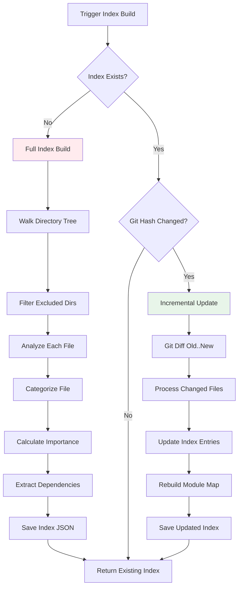
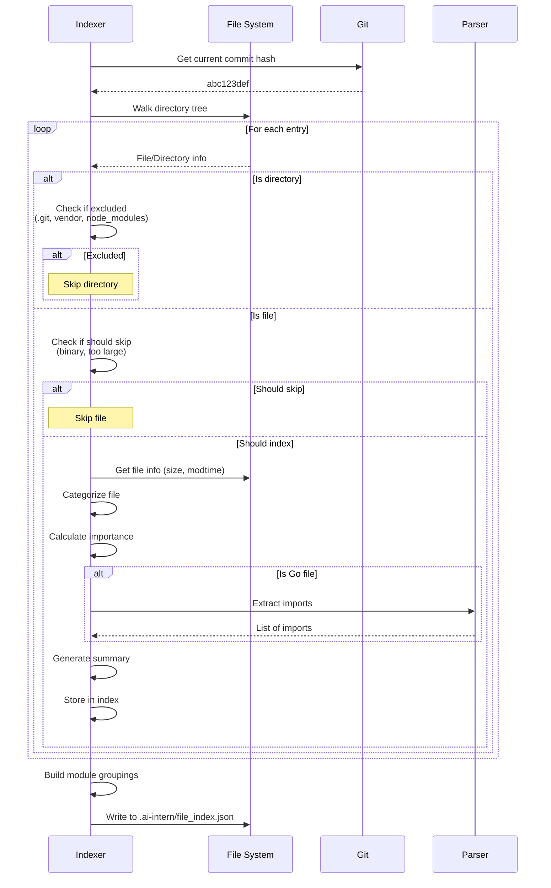
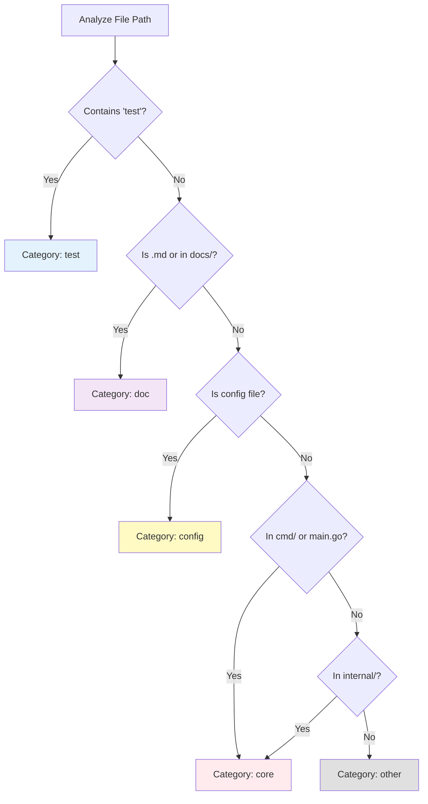
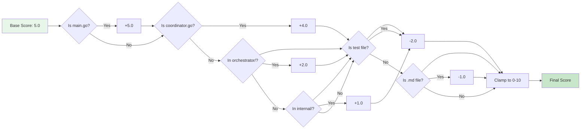
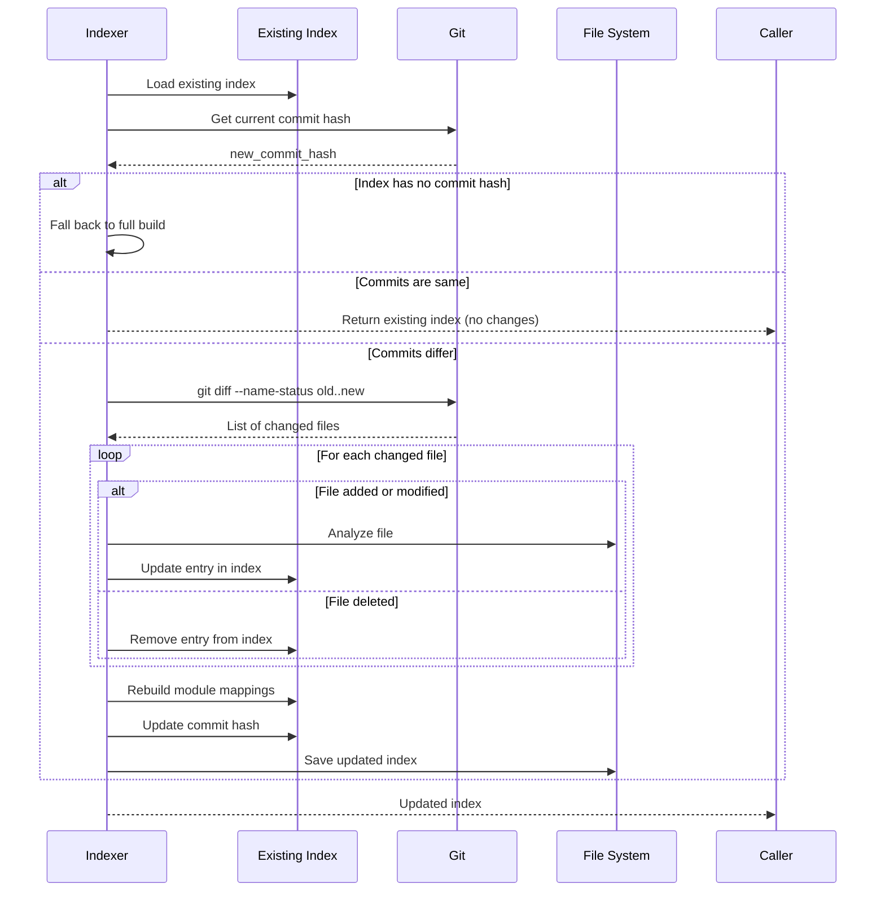
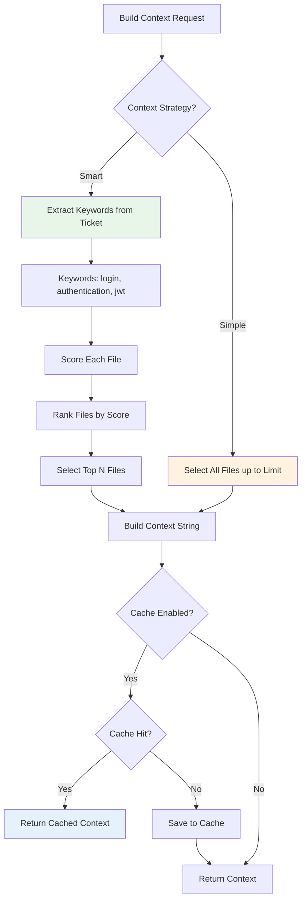
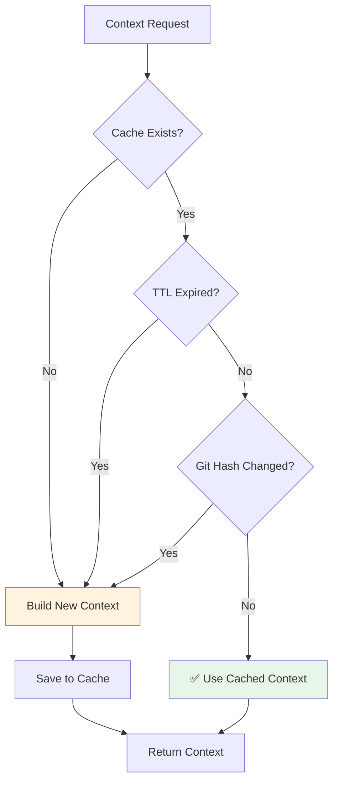

# Smart Indexing System

Comprehensive guide to the file indexing and smart context selection system.

## Overview

The indexing system builds a searchable repository index for intelligent context selection, reducing AI token usage by 30-70% while maintaining code quality.

## Index Architecture



## File Index Structure

### FileIndex Type

```go
type FileIndex struct {
    Version       string                  `json:"version"`
    IndexedAt     time.Time               `json:"indexed_at"`
    RepoRoot      string                  `json:"repo_root"`
    GitCommitHash string                  `json:"git_commit_hash"`
    Files         map[string]FileMetadata `json:"files"`
    Modules       map[string][]string     `json:"modules"`
}
```

**File**: `internal/indexer/types.go:5-13`

### FileMetadata

```go
type FileMetadata struct {
    Path         string    `json:"path"`          // Relative path
    Size         int64     `json:"size"`          // Bytes
    LastModified time.Time `json:"last_modified"`
    Category     string    `json:"category"`      // core/test/doc/config/other
    Importance   float64   `json:"importance"`    // 0-10 scale
    Dependencies []string  `json:"dependencies"`  // Go imports
    Summary      string    `json:"summary"`       // Human-readable description
}
```

**Example**:
```json
{
  "path": "internal/orchestrator/coordinator.go",
  "size": 25600,
  "last_modified": "2024-01-15T10:30:00Z",
  "category": "core",
  "importance": 9.0,
  "dependencies": [
    "context",
    "time",
    "intern/internal/ticketing",
    "intern/internal/repository",
    "intern/internal/ai/agent"
  ],
  "summary": "orchestrator - coordinator"
}
```

## Full Index Build

### Build Process



**File**: `internal/indexer/indexer.go:44-97`

### Excluded Directories

```go
var excludedDirs = []string{
    ".git",          // Git metadata
    "vendor",        // Go dependencies
    "node_modules",  // Node.js dependencies
    ".idea",         // JetBrains IDEs
    ".vscode",       // VSCode settings
    "build",         // Build outputs
    "dist",          // Distribution files
    "out",           // Output directories
    ".ai-intern",    // Our own data
    "workspace",     // Working directory
}
```

### Excluded Files

```go
var binaryExts = []string{
    ".png", ".jpg", ".jpeg", ".gif",  // Images
    ".pdf",                            // Documents
    ".zip", ".tar", ".gz", ".bz2",    // Archives
    ".exe", ".bin",                    // Executables
    ".dll", ".so", ".dylib",          // Libraries
    ".mp4", ".mov",                    // Videos
}

// Also skip files > 1MB
if fileInfo.Size() > 1*1024*1024 {
    return true  // Skip
}
```

## File Categorization

### Categories



**File**: `internal/indexer/indexer.go:152-174`

### Implementation

```go
func (idx *Indexer) categorizeFile(relPath string) string {
    lower := strings.ToLower(relPath)

    // Tests
    if strings.Contains(lower, "_test.go") || strings.Contains(lower, "/test/") {
        return "test"
    }

    // Documentation
    if strings.HasSuffix(lower, ".md") || strings.Contains(lower, "/docs/") {
        return "doc"
    }

    // Configuration
    if strings.Contains(lower, "config") ||
       strings.Contains(lower, ".env") ||
       strings.HasSuffix(lower, ".yaml") ||
       strings.HasSuffix(lower, ".yml") ||
       strings.HasSuffix(lower, ".json") {
        return "config"
    }

    // Core (entry points and internal)
    if strings.Contains(lower, "/cmd/") ||
       strings.Contains(lower, "main.go") ||
       strings.Contains(lower, "internal/") {
        return "core"
    }

    return "other"
}
```

## Importance Scoring

### Scoring Algorithm



**File**: `internal/indexer/indexer.go:176-221`

### Importance Examples

| File | Base | Modifiers | Final | Reason |
|------|------|-----------|-------|--------|
| `cmd/agent/main.go` | 5.0 | +5.0 (main) | **10.0** | Entry point |
| `internal/orchestrator/coordinator.go` | 5.0 | +4.0 (coord) +2.0 (orch) +1.0 (int) | **10.0** | Core orchestrator |
| `internal/ai/agent.go` | 5.0 | +1.0 (int) | **6.0** | Core interface |
| `internal/service_test.go` | 5.0 | +1.0 (int) -2.0 (test) | **4.0** | Test file |
| `docs/README.md` | 5.0 | -1.0 (doc) | **4.0** | Documentation |
| `scripts/deploy.sh` | 5.0 | (none) | **5.0** | Utility script |

## Dependency Extraction

### Go Import Detection

```go
func (idx *Indexer) extractDependencies(absPath, relPath string) []string {
    if !strings.HasSuffix(relPath, ".go") {
        return nil
    }

    content, _ := os.ReadFile(absPath)

    // Regex: import ( ... ) or import "..."
    importRegex := regexp.MustCompile(`import\s+(?:\(([^)]+)\)|"([^"]+)")`)
    matches := importRegex.FindAllStringSubmatch(string(content), -1)

    deps := make(map[string]bool)
    for _, match := range matches {
        if match[1] != "" {
            // Import block: extract each line
            lines := strings.Split(match[1], "\n")
            for _, line := range lines {
                if dep := extractImport(line); dep != "" {
                    deps[dep] = true
                }
            }
        } else if match[2] != "" {
            // Single import
            deps[match[2]] = true
        }
    }

    return mapToSlice(deps)
}
```

**Example**:
```go
// Input file
import (
    "context"
    "fmt"
    "time"

    "intern/internal/ticketing"
    "intern/internal/repository"
)

// Extracted dependencies
["context", "fmt", "time", "intern/internal/ticketing", "intern/internal/repository"]
```

## Incremental Updates

### Update Flow



**File**: `internal/indexer/incremental.go:77-175`

### Git Diff Parsing

```go
func (idx *Indexer) getChangedFiles(oldCommit, newCommit string) ([]string, error) {
    cmd := exec.Command("git", "diff", "--name-status", oldCommit, newCommit)
    cmd.Dir = idx.repoRoot
    output, _ := cmd.Output()

    // Parse output:
    // M    internal/service.go    (Modified)
    // A    internal/handler.go    (Added)
    // D    internal/old.go        (Deleted)
    // R100 old.go  new.go          (Renamed)

    lines := strings.Split(string(output), "\n")
    changedFiles := []string{}

    for _, line := range lines {
        parts := strings.Fields(line)
        if len(parts) >= 2 {
            status := parts[0]
            if strings.HasPrefix(status, "R") {
                // Rename: track both old and new
                changedFiles = append(changedFiles, parts[1], parts[2])
            } else {
                changedFiles = append(changedFiles, parts[1])
            }
        }
    }

    return changedFiles, nil
}
```

### Performance Comparison

| Operation | Files Changed | Full Build | Incremental | Speedup |
|-----------|---------------|------------|-------------|---------|
| First index | N/A | 2.5s | N/A | N/A |
| No changes | 0 | 2.5s | <10ms | **250x** |
| Small change | 5 | 2.5s | 80ms | **31x** |
| Medium change | 25 | 2.5s | 200ms | **12x** |
| Large change | 100+ | 2.5s | 800ms | **3x** |

## Smart Context Selection

### Context Building Flow



### Keyword Extraction

**File**: `internal/indexer/keywords.go:15-80`

```go
func ExtractKeywords(text string) []string {
    // 1. Tokenize
    words := tokenize(text)

    // 2. Filter stop words
    filtered := filterStopWords(words)

    // 3. Extract file paths
    filePaths := extractFilePaths(text)

    // 4. Extract identifiers (camelCase, snake_case)
    identifiers := extractIdentifiers(text)

    // 5. Combine and deduplicate
    allKeywords := append(filtered, filePaths...)
    allKeywords = append(allKeywords, identifiers...)

    return unique(allKeywords)
}
```

**Example**:
```
Input: "Add JWT authentication to login service in internal/auth"

Keywords extracted:
- "jwt"
- "authentication"
- "login"
- "service"
- "internal/auth"  (file path)
- "Auth"           (identifier from camelCase)
```

### File Scoring Algorithm

**File**: `internal/indexer/scorer.go:15-120`

```go
func ScoreFile(file FileMetadata, keywords []string) float64 {
    score := file.Importance  // Start with base importance (0-10)

    pathLower := strings.ToLower(file.Path)

    for _, keyword := range keywords {
        keyLower := strings.ToLower(keyword)

        // Exact path match: +20.0
        if keyLower == pathLower {
            score += 20.0
            continue
        }

        // Partial path match: +10.0
        if strings.Contains(pathLower, keyLower) {
            score += 10.0
            continue
        }

        // Path segment match: +5.0
        segments := strings.Split(pathLower, "/")
        for _, seg := range segments {
            if seg == keyLower {
                score += 5.0
                break
            }
        }
    }

    // Category multiplier
    multiplier := getCategoryMultiplier(file.Category)
    score *= multiplier

    return score
}

func getCategoryMultiplier(category string) float64 {
    switch category {
    case "core":   return 1.5   // Prioritize core files
    case "config": return 1.2
    case "other":  return 1.0
    case "test":   return 0.5   // De-prioritize tests
    case "doc":    return 0.3   // De-prioritize docs
    default:       return 1.0
    }
}
```

### Scoring Example

**Ticket**: "Add JWT authentication to user login"
**Keywords**: ["jwt", "authentication", "user", "login"]

| File | Importance | Keyword Matches | Category | Raw Score | × Multiplier | Final |
|------|------------|-----------------|----------|-----------|--------------|-------|
| `internal/auth/jwt.go` | 6.0 | jwt(+10), auth(+10) | core | 26.0 | × 1.5 | **39.0** |
| `internal/auth/middleware.go` | 6.0 | auth(+10) | core | 16.0 | × 1.5 | **24.0** |
| `internal/user/service.go` | 6.0 | user(+10) | core | 16.0 | × 1.5 | **24.0** |
| `internal/api/login.go` | 7.0 | login(+10) | core | 17.0 | × 1.5 | **25.5** |
| `internal/user_test.go` | 4.0 | user(+10) | test | 14.0 | × 0.5 | **7.0** |
| `docs/AUTH.md` | 4.0 | auth(+10) | doc | 14.0 | × 0.3 | **4.2** |

**Selected Files** (top 4): jwt.go, login.go, middleware.go, service.go

## Minimal Context Extraction

For large Go files, extract only signatures instead of full content:

```go
func ExtractMinimalContext(filePath string) string {
    content, _ := os.ReadFile(filePath)

    // Parse Go AST
    fset := token.NewFileSet()
    file, _ := parser.ParseFile(fset, filePath, content, parser.ParseComments)

    var builder strings.Builder

    // 1. Package declaration
    builder.WriteString(fmt.Sprintf("package %s\n\n", file.Name.Name))

    // 2. Type declarations (structs, interfaces)
    for _, decl := range file.Decls {
        if genDecl, ok := decl.(*ast.GenDecl); ok && genDecl.Tok == token.TYPE {
            // Write full type definition
            builder.WriteString(formatTypeDecl(genDecl))
        }
    }

    // 3. Function signatures only (no body)
    for _, decl := range file.Decls {
        if funcDecl, ok := decl.(*ast.FuncDecl); ok {
            builder.WriteString(formatFuncSignature(funcDecl))
        }
    }

    return builder.String()
}
```

**Example**:
```go
// Full file (2KB):
package service

import "context"

type UserService struct {
    db Database
}

func NewUserService(db Database) *UserService {
    // ... implementation ...
    return &UserService{db: db}
}

func (s *UserService) GetUser(ctx context.Context, id string) (*User, error) {
    // ... 50 lines of implementation ...
}

// Minimal context (200 bytes):
package service

type UserService struct {
    db Database
}

func NewUserService(db Database) *UserService
func (s *UserService) GetUser(ctx context.Context, id string) (*User, error)
```

**Savings**: 90% reduction for large files, maintains type information

## Context Cache

### Cache Structure

```go
type ContextCache struct {
    BaseContext   string    `json:"base_context"`
    RepoPath      string    `json:"repo_path"`
    GitCommitHash string    `json:"git_commit_hash"`
    CreatedAt     time.Time `json:"created_at"`
    FilesIncluded []string  `json:"files_included"`
    ContextBytes  int       `json:"context_bytes"`
}
```

**File**: `.ai-intern/context_cache.json`

### Cache Invalidation



### Implementation

```go
func (cb *ContextBuilder) BuildContext(ticket Ticket, repoPath string) string {
    if !cb.cfg.ContextCacheEnabled {
        return cb.buildFresh(ticket, repoPath)
    }

    cache := cb.loadCache(repoPath)
    if cache != nil && !cb.isStale(cache, repoPath) {
        logger.Info("Using cached context", "age", time.Since(cache.CreatedAt))
        return cache.BaseContext
    }

    // Build new context
    context := cb.buildFresh(ticket, repoPath)

    // Save to cache
    cb.saveCache(repoPath, context)

    return context
}

func (cb *ContextBuilder) isStale(cache *ContextCache, repoPath string) bool {
    // Check TTL
    if time.Since(cache.CreatedAt) > cb.cfg.ContextCacheTTL {
        return true
    }

    // Check git hash
    currentHash := getGitCommitHash(repoPath)
    if currentHash != cache.GitCommitHash {
        return true
    }

    return false
}
```

### Cache Performance

| Scenario | Build Time | Cache Hit | Savings |
|----------|------------|-----------|---------|
| First build | 500ms | N/A | - |
| No changes (cached) | 5ms | ✅ | **99%** |
| Small changes (invalidated) | 500ms | ❌ | 0% |
| Context TTL expired | 500ms | ❌ | 0% |

## Configuration

```bash
# Context limits
CONTEXT_MAX_FILES=40      # Max files in context
CONTEXT_MAX_BYTES=32768   # Max bytes per file (32KB)

# Context caching
CONTEXT_CACHE_ENABLED=true
CONTEXT_CACHE_TTL=1h      # Cache validity duration

# Index location
# Automatically: {WORKING_DIR}/{GITHUB_REPO}/.ai-intern/
```

## CLI Commands

```bash
# Build index (full or incremental)
./agent --build-index

# View index statistics
./agent --status
# Output shows:
#   Index: 245 files, Smart context: 18 files selected
```

## Performance Tuning

### Token Reduction Strategies

| Strategy | Token Reduction | Build Time Impact |
|----------|----------------|-------------------|
| Smart context selection | 30-40% | +200ms (initial) |
| Minimal Go extraction | 50-70% | +100ms |
| Context caching | 100% (on hit) | -495ms |
| **Combined** | **70-85%** | Variable |

### Recommended Settings

**For cost optimization**:
```bash
CONTEXT_MAX_FILES=30
CONTEXT_CACHE_ENABLED=true
CONTEXT_CACHE_TTL=2h
```

**For quality (more context)**:
```bash
CONTEXT_MAX_FILES=50
CONTEXT_MAX_BYTES=65536
CONTEXT_CACHE_ENABLED=true
```

**For speed**:
```bash
CONTEXT_MAX_FILES=20
CONTEXT_CACHE_TTL=4h
# Use simple context (fallback)
```

## Troubleshooting

### Issue: Index build is slow
- **Check**: Repository size (files > 1000?)
- **Solution**: Ensure excluded dirs are configured
- **Workaround**: Use incremental updates (automatic)

### Issue: Context too large
- **Check**: CONTEXT_MAX_FILES setting
- **Solution**: Reduce to 20-30 files
- **Also**: Enable minimal extraction for Go files

### Issue: Relevant files not selected
- **Check**: File importance scores in index
- **Solution**: Adjust scoring algorithm
- **Workaround**: Use simple context strategy

### Issue: Cache never hits
- **Check**: Git commits changing frequently?
- **Solution**: Increase CONTEXT_CACHE_TTL
- **Check**: Files being modified during build?

## Next Steps

- [Context Optimization](CONTEXT_OPTIMIZATION.md) - Advanced strategies
- [Architecture](ARCHITECTURE.md) - System overview
- [Ticket Flow](TICKET_FLOW.md) - End-to-end processing
