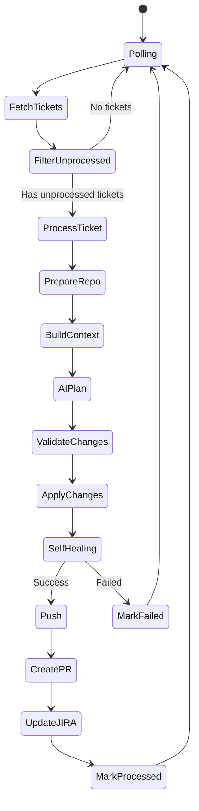
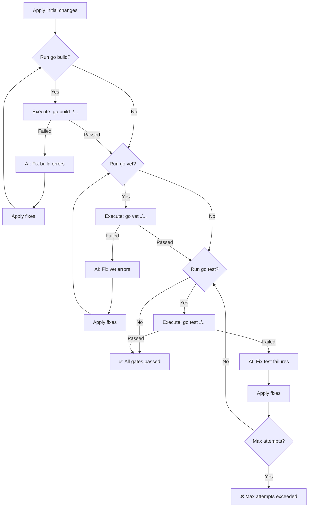
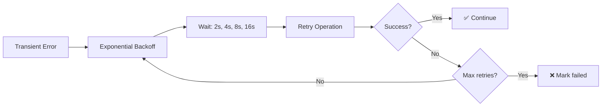

# Ticket Processing Flow

Complete end-to-end flow of how a JIRA ticket is processed by the AI Intern Agent.

## High-Level Flow



## Detailed Sequence Diagram

```mermaid
sequenceDiagram
    autonumber
    actor User
    participant JIRA
    participant Agent as AI Agent
    participant Repo as Repository Service
    participant Index as Indexer
    participant Context as Context Builder
    participant AI as AI Provider
    participant Heal as Self-Healing
    participant GitHub

    Note over Agent: Polling Loop (every 30s)

    Agent->>JIRA: GET /search (JQL: assignee=ai-intern)
    JIRA-->>Agent: List of tickets

    Agent->>Agent: Filter out processed tickets<br/>(check agent_state.jsonc)

    Note over Agent: Process each ticket concurrently<br/>(respect MAX_CONCURRENT_TICKETS)

    rect rgb(255, 245, 224)
        Note over Agent,GitHub: TICKET PROCESSING PIPELINE

        Agent->>JIRA: POST /transition (To Do → In Progress)

        Agent->>Repo: PrepareRepository()
        alt Repository doesn't exist
            Repo->>GitHub: Clone repository
        else Repository exists
            Repo->>Repo: Git pull origin/master
        end
        Repo->>Repo: Checkout base branch
        Repo->>Repo: Create feature branch<br/>(feature/PROJ-123)

        Agent->>Index: BuildIndex() or UpdateIndex()
        alt Index doesn't exist
            Index->>Index: Full scan of repository
            Index->>Index: Categorize files (core/test/doc)
            Index->>Index: Calculate importance scores
            Index->>Index: Extract dependencies
        else Index exists
            Index->>Repo: Get git diff (old commit → new commit)
            Index->>Index: Update changed files only
        end
        Index-->>Agent: File index with metadata

        Agent->>Context: BuildContext(ticket, index)
        alt Smart context strategy
            Context->>Context: Extract keywords from ticket
            Context->>Context: Score files by relevance
            Context->>Context: Select top N files (CONTEXT_MAX_FILES)
            Context->>Context: Extract minimal signatures
        else Simple context strategy
            Context->>Context: Select all files (up to limit)
        end

        alt Context cache enabled
            Context->>Context: Check cache (git hash + TTL)
            alt Cache hit
                Context-->>Agent: Cached context (save 40% tokens)
            else Cache miss
                Context->>Context: Build new context
                Context->>Context: Save to cache
            end
        end

        Context-->>Agent: Optimized repo context

        Agent->>AI: PlanChanges(ticket, context)
        Note over AI: Claude Sonnet 4 or Ollama LLM
        AI->>AI: Analyze ticket requirements
        AI->>AI: Review codebase context
        AI->>AI: Generate code changes
        AI-->>Agent: CodeChanges[] + UsageMetrics

        Agent->>Agent: ValidateChanges()
        Agent->>Agent: Check path traversal
        Agent->>Agent: Verify allowed directories
        Agent->>Agent: Enforce file count limit

        loop For each change
            Agent->>Repo: Write file to disk
        end

        Agent->>Repo: Git commit -m "feat(PROJ-123): ..."

        rect rgb(252, 228, 236)
            Note over Agent,Heal: SELF-HEALING PIPELINE

            Agent->>Heal: Run self-healing pipeline

            loop Max 3 attempts
                alt SELF_HEAL_ON_BUILD enabled
                    Heal->>Heal: Run go build ./...
                end

                alt SELF_HEAL_ON_VET enabled
                    Heal->>Heal: Run go vet ./...
                end

                alt SELF_HEAL_ON_TESTS enabled
                    Heal->>Heal: Run go test ./...
                end

                alt Quality gate failed
                    Heal->>Heal: Extract error summary
                    Heal->>AI: FixErrors(errorType, errorOutput, previousChanges)
                    AI->>AI: Analyze errors
                    AI->>AI: Generate fixes
                    AI-->>Heal: Fixed CodeChanges[]

                    loop For each fix
                        Heal->>Repo: Write fix to disk
                    end

                    Heal->>Repo: Git commit --amend (add fixes)
                    Note over Heal: Loop back to retry gates
                else Quality gates passed
                    Note over Heal: Break loop, success!
                end
            end

            Heal-->>Agent: Success or max attempts exceeded
        end

        alt Self-healing succeeded
            Agent->>Repo: Git push -u origin feature/PROJ-123

            Agent->>GitHub: POST /repos/{owner}/{repo}/pulls
            Note over GitHub: Create PR with:<br/>- Title: [PROJ-123] Summary<br/>- Body: Description + changed files<br/>- Base: master<br/>- Head: feature/PROJ-123
            GitHub-->>Agent: PR URL

            Agent->>JIRA: POST /transition (In Progress → Done)

            Agent->>Agent: Mark ticket as processed<br/>(save to agent_state.jsonc)

            Agent->>Agent: Record metrics<br/>(cost, tokens, time, files)

            Note over User: User reviews PR on GitHub
        else Self-healing failed
            Agent->>Agent: Mark ticket as failed
            Agent->>Agent: Record failure metrics
            Note over Agent: Ticket NOT marked as processed<br/>(will retry next cycle)
        end
    end

    Note over Agent: Sleep for POLLING_INTERVAL
    Agent->>Agent: Loop back to polling
```



## Pipeline Stages Explained

### Stage 1: Ticket Discovery
**File**: `internal/orchestrator/coordinator.go:70-90`

```go
func (c *Coordinator) Run(ctx context.Context) {
    for {
        tickets, err := c.Ticketing.FetchAssignedTickets(c.Cfg.AgentUsername)
        // Filter out already processed tickets
        unprocessed := filterUnprocessed(tickets, c.State)
        // Process each ticket (with concurrency control)
        for _, ticket := range unprocessed {
            c.processTicket(ctx, ticket)
        }
        time.Sleep(interval)
    }
}
```

**Key Points**:
- Polls JIRA every `POLLING_INTERVAL` (default: 30s)
- Filters using JQL: `assignee = {AGENT_USERNAME} AND status = 'To Do'`
- Skips tickets in `agent_state.jsonc` (already processed)
- Respects `MAX_CONCURRENT_TICKETS` semaphore

### Stage 2: Repository Preparation
**File**: `internal/orchestrator/coordinator.go:250-280`

**Operations**:
1. **Clone** (first time only): `git clone <repo_url> workspace/<repo_name>`
2. **Sync**: `git fetch origin && git pull origin master`
3. **Branch**: `git checkout -b feature/PROJ-123`

**Directory Structure**:
```
./workspace/
  └── <GITHUB_REPO>/
      ├── .git/
      ├── .ai-intern/
      │   ├── file_index.json     # Smart index
      │   ├── context_cache.json  # Context cache
      │   └── metrics.json        # Metrics output
      └── <source files>
```

### Stage 3: Index Building
**File**: `internal/indexer/indexer.go:44-97` (full), `internal/indexer/incremental.go:77-175` (incremental)

**Full Index**:
- Walks entire directory tree
- Skips: `.git`, `vendor`, `node_modules`, `build`, `dist`
- Categorizes: core, test, doc, config, other
- Scores importance (0-10 scale)
- Extracts Go imports

**Incremental Index**:
1. Load existing index
2. Get git commit hashes (old vs new)
3. Run `git diff --name-status <old> <new>`
4. Update only changed files (added/modified/deleted)
5. Rebuild module mappings

**Performance**:
- Full: 2-5 seconds for 1000 files
- Incremental: 50-200ms for 10 changed files

### Stage 4: Context Building
**File**: `internal/ai/context_builder.go:45-200`

**Smart Context Strategy**:
```go
// 1. Extract keywords from ticket
keywords := extractKeywords(ticket.summary + " " + ticket.description)

// 2. Score files
fileScores := scoreFiles(index, keywords)

// 3. Select top N files
topFiles := selectTopFiles(fileScores, CONTEXT_MAX_FILES)

// 4. Build minimal context
for _, file := range topFiles {
    if isGoFile(file) {
        context += extractMinimalContext(file) // Signatures only
    } else {
        context += readFullFile(file) // Full content
    }
}
```

**Context Cache**:
- Key: `repo_path + git_commit_hash`
- TTL: `CONTEXT_CACHE_TTL` (default: 1 hour)
- Invalidation: Git commit change OR TTL expiry
- Savings: 40-50% token reduction

**Output Size**:
- Smart context: 50-200KB (12K-50K tokens)
- Simple context: 100-500KB (25K-125K tokens)

### Stage 5: AI Planning
**File**: `internal/ai/agent/anthropic/client.go:25-100` or `internal/ai/agent/ollama/client.go:25-120`

**Prompt Structure**:
```
You are a senior Go engineer working on {repo_name}.

TICKET: {ticket_key} - {ticket_summary}
DESCRIPTION: {ticket_description}

REPOSITORY CONTEXT:
{optimized_repo_context}

Generate code changes as JSON array:
[
  {"path": "internal/service.go", "content": "..."},
  {"path": "internal/service_test.go", "content": "..."}
]
```

**AI Provider Selection**:
- **Anthropic Claude Sonnet 4**: $3/M input tokens, $15/M output tokens
- **Ollama (qwen2.5-coder:7b)**: Free, local GPU/CPU
- **Ollama (deepseek-coder:6.7b)**: Free, local GPU/CPU

**Response Parsing**:
- Extract JSON from response
- Parse into `[]CodeChange` struct
- Track usage metrics (tokens, cost, latency)

### Stage 6: Change Validation
**File**: `internal/orchestrator/validation.go:15-90`

**Validation Rules**:
1. **Path Traversal**: Reject paths with `..`
2. **Absolute Paths**: Reject paths starting with `/`
3. **Directory Allowlist**: Only `ALLOWED_WRITE_DIRS` (default: internal, cmd, pkg, docs, config, .)
4. **Empty Content**: Reject files with no content
5. **File Count**: Max `PLAN_MAX_FILES` (default: 20)

**Example Rejection**:
```go
// REJECTED: Path traversal
{"path": "../../../etc/passwd", "content": "..."}

// REJECTED: Absolute path
{"path": "/etc/passwd", "content": "..."}

// REJECTED: Disallowed directory
{"path": "malicious/backdoor.go", "content": "..."}

// ACCEPTED: Valid path
{"path": "internal/service/handler.go", "content": "..."}
```

### Stage 7: Self-Healing Pipeline
**File**: `internal/orchestrator/self_heal.go:102-253`

**Flow**:


**Configuration**:
```bash
SELF_HEAL_ENABLED=true        # Enable feature
SELF_HEAL_MAX_ATTEMPTS=3      # Max retry loop iterations
SELF_HEAL_ON_BUILD=false      # Check build errors
SELF_HEAL_ON_VET=true         # Check go vet
SELF_HEAL_ON_TESTS=true       # Check go test
```

**Healing Prompt**:
```
You are a senior Go engineer fixing errors in code you previously generated.

Original ticket: PROJ-123 - Add user authentication

Error type: test
Error output:
```
--- FAIL: TestUserAuth (0.00s)
    auth_test.go:25: expected true, got false
```

Previous changes:
[... code you generated ...]

Generate fixes as JSON array.
```

### Stage 8: PR Creation
**File**: `internal/repository/github/client.go:150-200`

**PR Format**:
```markdown
Title: [PROJ-123] Add user authentication

Body:
## Summary
Implements user authentication with JWT tokens

## Changes
- ✅ internal/auth/jwt.go (NEW)
- ✅ internal/auth/middleware.go (NEW)
- ✅ internal/auth/jwt_test.go (NEW)

## Quality Gates
✅ Build: Passed
✅ Vet: Passed
✅ Tests: Passed (3 attempts, self-healed)

## Metrics
- Cost: $0.45
- Tokens: 45K input, 8K output
- Time: 23s
- Context: Smart (15 files selected)

Closes PROJ-123
```

### Stage 9: State Persistence
**Files**: `internal/orchestrator/state.go`, `internal/orchestrator/persistence.go`

**agent_state.jsonc**:
```json
{
  "processed": {
    "PROJ-123": true,
    "PROJ-124": true,
    "PROJ-125": true
  }
}
```

**metrics.json**:
```json
{
  "run_metadata": {
    "timestamp": "2024-01-15T10:30:00Z",
    "duration_seconds": 45.2,
    "agent_version": "2.0.0"
  },
  "summary": {
    "tickets_processed": 3,
    "prs_created": 3,
    "total_cost": 1.35,
    "smart_context_used": 3,
    "heal_attempts": 2,
    "heal_successes": 2
  },
  "tickets": [...]
}
```

## Error Handling

### Transient Errors (Retry)


**Examples**:
- Network timeouts
- GitHub rate limits
- JIRA API errors
- Temporary file locks

### Permanent Errors (Fail Fast)
- Authentication failures
- Invalid configuration
- Validation errors
- Permission denied

## Performance Metrics

### Typical Ticket Processing Time

| Stage | Duration | Notes |
|-------|----------|-------|
| Fetch tickets | 200-500ms | JIRA API latency |
| Prepare repo | 100ms | Incremental pull |
| Build index | 100ms | Incremental update |
| Build context | 300ms | Smart + cached |
| AI planning | 15-25s | Main bottleneck |
| Apply changes | 50ms | File writes |
| Self-healing | 5-15s | If needed (66% success rate) |
| Push + PR | 1-2s | GitHub API |
| **Total** | **20-45s** | Per ticket |

### Token Usage

| Context Strategy | Size | Tokens | Cost (Claude) |
|-----------------|------|---------|---------------|
| Simple (no cache) | 400KB | 100K | $0.30 |
| Simple (cached) | 0KB | 0K | $0.00 |
| Smart (no cache) | 150KB | 37K | $0.11 |
| Smart (cached) | 0KB | 0K | $0.00 |

**Best Practice**: Enable smart context + caching for 70% cost reduction

## Configuration Reference

### Minimal Configuration
```bash
# Required
JIRA_URL=https://company.atlassian.net
JIRA_EMAIL=ai@company.com
JIRA_API_TOKEN=xxx
JIRA_PROJECT_KEY=PROJ

GITHUB_TOKEN=ghp_xxx
GITHUB_OWNER=company
GITHUB_REPO=main-repo

ANTHROPIC_API_KEY=sk-ant-xxx  # OR use Ollama

AGENT_USERNAME=ai-intern
```

### Optimized Configuration
```bash
# All required fields above, plus:

# Context optimization
CONTEXT_CACHE_ENABLED=true
CONTEXT_CACHE_TTL=1h
CONTEXT_MAX_FILES=30

# Self-healing
SELF_HEAL_ENABLED=true
SELF_HEAL_MAX_ATTEMPTS=3
SELF_HEAL_ON_VET=true
SELF_HEAL_ON_TESTS=true

# Metrics
METRICS_ENABLED=true
METRICS_PORT=9090

# Cost optimization (use local LLM)
AI_PROVIDER=ollama
OLLAMA_MODEL=qwen2.5-coder:7b
```

## Troubleshooting

### Ticket Not Processing
1. Check `agent_state.jsonc` - Already processed?
2. Check JIRA assignee - Correct username?
3. Check logs - Any errors during fetch?
4. Run `./agent --status` to see configuration

### High Costs
1. Enable context caching: `CONTEXT_CACHE_ENABLED=true`
2. Use smart context (automatic with index)
3. Consider Ollama for local processing
4. Monitor with `./agent --metrics`

### Self-Healing Fails
1. Check quality gate configuration
2. Review error logs in metrics
3. May need manual intervention for complex errors
4. Consider increasing `SELF_HEAL_MAX_ATTEMPTS`

### PR Not Created
1. Check GitHub token permissions
2. Verify branch doesn't already exist
3. Check for git conflicts
4. Review logs for push errors

## Next Steps

- [Coordinator Details](COORDINATOR.md) - Deep dive into orchestration
- [Self-Healing System](SELF_HEALING.md) - Error fixing workflow
- [Smart Indexing](INDEXING.md) - Context optimization
- [Metrics Dashboard](METRICS_DASHBOARD.md) - Observability
